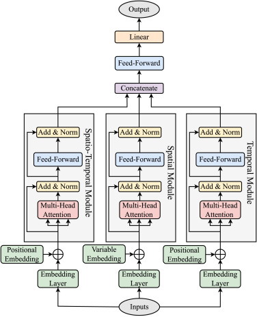

# Multivariate time series forecasting with transformers

[Enefit - Predict Energy Behavior of Prosumers Kaggle Chalenge](https://www.kaggle.com/competitions/predict-energy-behavior-of-prosumers/overview)

### Summary:
An approach utilizing an encoder-decoder spatio-temporal transformer model was employed to tackle the challenge of forecasting multiple time series data. The results showed quite high accuracy, proving that this method is well suited for solving multiple time series forecasting problems.

### Motivation
I wished to gain some experience in applying transformers to time series forecasting problems and develop a working model that could be applied to other similar problems as a baseline approach.

### Problem statement:
With day-ahead electricity and gas prices, weather forecast, data history up to and including yesterday, predict tomorrow's hourly electricity consumption/production for about 70 solar-equipped customers. Target metric: total MAE.

### Data description
1. Historical consumption/production customer-/hour-specific data (about 130-140 time series with very different scales)
2. Some customer attributes 
3. Min-max hour electricity DA hour-specific prices; gas daily DA prices
4. Customers installed capacity
5. Historical wether (14 factors) for 112 weather stations, badly specified per counties
6. Forecast wether (12 factors) for 112 weather stations, badly specified per counties

### Model specification
The model is based on the approach suggested in [STTRE: A Spatio-Temporal Transformer with Relative Embeddings for multivariate time series forecasting](https://www.sciencedirect.com/science/article/pii/S0893608023005361?ssrnid=4404879&dgcid=SSRN_redirect_SD).The authors introduced the following spatio-temporal encoder-transformer architecture applied to predict a single value of a multivariate time series.



Applying this approach to the problem described above required some adjustments:

1. Development of the decoder block
2. Development of the cross-attention module (self-attention module as well as encoder were borrowed from the paper repo)
3. Modification of embedding layers

Below are some key aspects of the model:

1. The model predicts 2*24 values of consumption/production for a single customer 
2. Encoder is fed about 58 historical time series (consumption/production, prices, actual weather, polar time encoding etc.)
3. Decoder is fed about 48 historical time series (prices, weather forecast, polar time encoding etc.)
4. Single time series embedding layer along with the actual feature values is also fed with one-hot encoded customer characteristics 
5. The decoder layer consists of soft-attention transformation (identical to the encoder) followed by cross-attention transformation of encoder memory tensor (keys, values) and soft-attention embedding tensor (queries)
6. Model structure:

    Single time series embedding: $\mathbb{R}^6 \to \mathbb{R}^{D}$, where $5$ - dim of oh-vector of customer characteristics, $D$ - embedding dim

    Encoder: $\mathbb{R}^{N \times D} \to \mathbb{R}^{N \times D}$, $N$ - time horizon of historical data

    Decoder soft-attention: $\mathbb{R}^{M \times D} \to \mathbb{R}^{M \times D}$, $M$ - 24 hour prediction horizon

    Decoder cross-attention: 
    
    $attention(V, K, Q) \to \mathbb{R}^{M \times D}$, where $V \in \mathbb{R}^{N \times D}$, $K \in \mathbb{R}^{N \times D}$, $Q \in \mathbb{R}^{M \times D}$

    MLP regressor: $\mathbb{R}^{M \times D} \to \mathbb{R}^{48}$
   
7. I tried two different approaches to aggregate weather information from 112 stations:
   - added a MLP block to extract customer-specific information,
   - took min, max, mean values per county for each weather feature.

   The second one gave the best results.

### Training
As mentioned above, the predicted time series had very different scales with a median/min ratio of about 35 and max/median of about 100, so that 1% of the data was responsible for 25% of the final metric and about 25% of the data was responsible for 90% of the final metric. Using absolute values as targets resulted in very unstable training (which is logical since a significant portion of the data had little or no effect on the loss function). After I took individually scaled time series as target values, the learning behavior changed dramatically. But this led to task substitution, so that the problem to be solved was different from the one defined in the competition. Nevertheless this substitution allowed to get quite good ultimate result, but it was not enough to make it to the top of the leaderboard.

Below I would like to point out a few observations that I find interesting:
- Loss function: 
  - Individual scaling for each of consumption/production time series was crucial
  - MSE loss worked a little bit better as MAE (target metric)
- Low embedding dimensionality worked better than larger
- The distribution of the last 15% of the target values differs from the rest, that lead to wrong batch normalization on evaluation, so it was crucial to use ```track_running_stats=False``` flag in ```nn.BatchNorm1d```
- Minmax normalization worked better as standard scaler
- Using a one-day history provided better quality than using a longer history
- I tried to use a weighted loss function, but it followed to underfitting

### Results and conclusions
Unfortunately, I joined the competition too late (the deadline was less than two weeks away), so I was only interested in the overall quality of the approach and didn't invest much time in model tuning.

I was able to get rather stable model quality (without stacking):
- training metric (MAE on individually normalized time series): 0.045 - 0.046
- target metric (MAE on absolute values): 64-66. As a benchmark: first place (out of about 2600 teams) was 57.5

Due to limited time and computing resources, I could not afford to experiment with too many different architectures as well as hyperperparameters tuning. However, I believe the approach could have achieved better results, as well as be more effective in case of more balanced data. 

In any way the model can be used as a baseline, as it can be used almost out of the box, since it requires minimal adjustments and no feature engineering, yet still delivers reasonably accurate results.